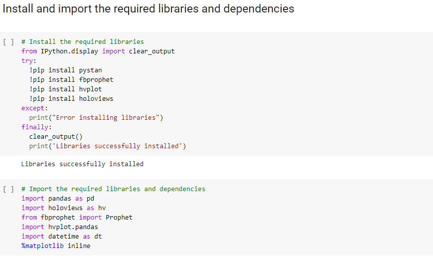
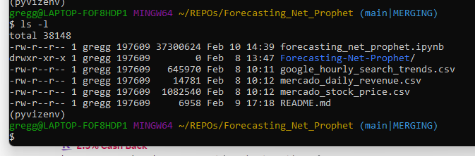

# Forecasting-Net-Prophet
 
 
 
 


In the Assignment, I will assume the role of a growth analyst at MercadoLibre - a very popular e-commerce site in Latin America. With a task of analyzing the company's financial and user data, I need to find various ways to make the company grow. Using my newly acquired skills of forecasting the future with Prophet, I will predict search traffic and translate it into the ability to successfully trade the stock.


# Forecasting

Forecasting With Prophet 

How to install


## Overview of the project and project goals

The goal is to create a Jupyter notebook that contains all data preparation, analysis, and visualizations for all the time series data that the company needs to understand. Text and comments to document my findings, and answered the question prompts in the instructions, plot the results so that we can visually show illustrate the predictions.


## Software version control


### Libraries 
*  Pandas - is a software library designed for data analytics that makes it easier to work with data from practically any type of file. Pandas supplies powerful tools for working with time data in particular, and time is a key aspect of financial analysis. Analysts typically compare and measure financial assets—from single stocks to large portfolios—across time.
*  Prophet - is a procedure for forecasting time series data based on an additive model where non-linear trends are fit with yearly, weekly, and daily seasonality, plus holiday effects. It works best with time series that have strong seasonal effects and several seasons of historical data. Prophet is robust to missing data and shifts in the trend, and typically handles outliers well.

* Following libraries were imported.
* The following dependencies were installed in order to use google colab.





### Interfaces

Google Colab is an Integrated Development Environment (IDE) that allows users to run Jupyter Notebooks in the cloud.

 
### GitHub
* Repository created on GitHub
* Files were committed using the command line in GITBASH
* My repository is organized to include resources folders with CSV files
* Jupyter Notebook with code, runs without errors.
* Answers on questions are included

### How to install

* Save the REPO from created in GitHub to the computer via the following path:

   cd/REPOs/Forecasting-Net-Prophet



```
cd desktop

git clone https://github.com/gsaldutti/forecasting-net-prophet.git
```


* We will run a Jupyter Notebook in [Google Colab](https://colab.research.google.com/) 
*  Choose [ forecasting_net_prophet.ipynb ] file in Forecasting folder to see the analysis report.


[

](url)

The following code in the document promts you to Choose appropriate CSV file to access the data 

```
from google.colab import files
uploaded = files.upload()

```


### Particularly in "Step 1: Find Unusual Patterns in Hourly Google Search Traffic"


[

](url)


###  and "Step 3: Relate the Search Traffic to Stock Price Patterns"


[

](url)


### Results and summary of the analysis

- Step 1.


[

](url)


- Step 2.


[

](url)


- Step 3.


[

](url)


- Step 4. 


[

](url)


- Explore the correlation:


[

](url)


- Forcast with Prophet


[

](url)


- Slice and explore the data:


[

](url)

[

](url)


